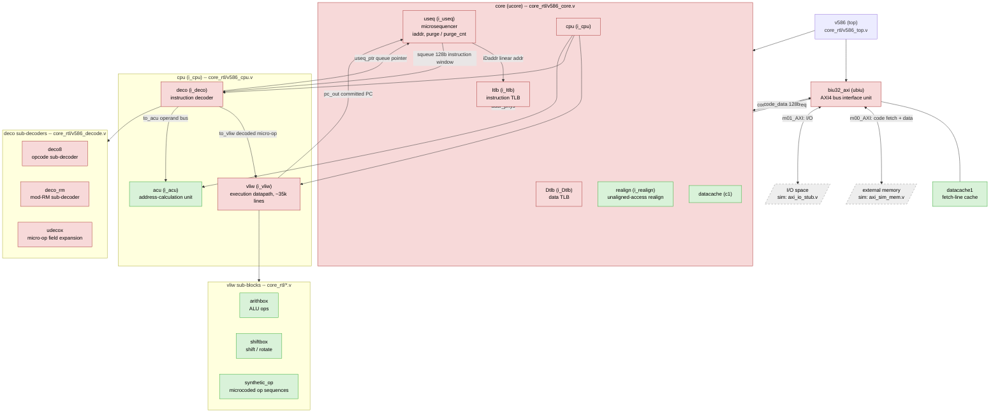

# core_rtl -- module map and open investigation

This document indexes the module hierarchy under `core_rtl/` (see the
top-level [`README`](../README) for how the files here relate to the
original monolithic `v586.v`), and tracks the state of an ongoing
reverse-engineering investigation into the core's reset/boot behavior
(carried out via the Verilator testbench in [`../sim/`](../sim/)).

## Functional block diagram

Red = gate-level netlist (synthesized, no surviving behavioral
structure). Green = readable hand-written behavioral RTL. Grey/dashed =
external to the core (simulation model or real memory/IO).

`dbg_useq_ptr` and `dbg_pc_out` (added to `core`/`v586`'s port lists,
see `v586_core.v`/`v586_top.v`) expose `deco`'s `useq_ptr` and `cpu`'s
`pc_out` for simulation observability -- see
[`../sim/README.md`](../sim/README.md) for why those were added and what
they've shown so far.

## Open investigation: reset vector / boot-time execution pointer

Summary of where this stands (full detail and running log of evidence in
[`../sim/README.md`](../sim/README.md)):

- **Confirmed** (netlist-level, not just simulation): `useq.iaddr`'s
  power-on reset value is `0x000FFC00`, encoded via the async set/clear
  primitive choice on `addr_reg_0`..`addr_reg_31`. This branch briefly
  edited 6 of those registers to change it to `0xFFFF0`, then reverted
  that edit -- `iaddr`'s reset value is back to the confirmed real
  `0xFFC00` in `core_rtl/v586_useq.v`. Reverted because `dbg_pc_out`
  tracing showed the edit didn't change where real execution starts
  anyway (see next point), so it was adding a confound rather than
  answering the actual question.
- **Major finding: `dbg_pc_out` (and the real fetch address) encode
  `{CS, IP}` as a raw 16+16-bit concatenation, not a computed physical
  address.** Discovered via a `boot.asm`-based test (NASM-assembled,
  see `sim/rom/`) containing a far jump (`0xEA`, `JMP ptr16:16`).
  Confirmed three times with three different segment values (`CS=0xF000`,
  `CS=0xFFFF`, `CS=0x000F`) -- in every case the observed fetch address
  and `dbg_pc_out` matched `(CS<<16) | IP` exactly, not real-mode
  `CS*16 + IP`. This retroactively explains earlier confusion: during
  early boot CS happens to be small, so `{CS,IP}` and a real 20-bit
  physical address were numerically indistinguishable, masking this
  until a far jump loaded a large CS value.
- **`sim/rtl/axi_sim_mem.v` now has a shadow ROM mapping** at
  `SHADOW_BASE` (`0xFFFE_0000`, chosen so the full 128KiB `ROM_BYTES`
  fits exactly against the 32-bit address ceiling with no truncation --
  watch for overflow if you change this parameter, see the comment
  there) mirroring the same ROM content, added specifically to observe
  fetches that land near the top of the address space under the
  `CS<<16|IP` hypothesis instead of just reading unmapped zeros.
- **Important correction: instruction-length-aware `pc_out` advancement
  is NOT proof of real execution/retirement.** A `mov ax,0xbeef` /
  `out 0x80,ax` pair was placed at a far-jump target; `dbg_pc_out`
  advanced by exactly 5 (3+2 bytes) in one step, correctly respecting
  both instructions' lengths -- but direct VCD inspection of
  `m01_AXI_AWVALID`/`WVALID` showed the core never actually issued the
  I/O write. So correct length-aware PC advancement is consistent with
  either real execution *or* a prefetch/queue-fill mechanism that parses
  instruction boundaries without retiring them. `sim_main.cpp`'s
  `--io-port` write logging (default port `0x80`) exists specifically to
  get a real, unambiguous "this executed with a side effect" signal
  instead of inferring from PC movement alone -- prefer it over `pc_out`
  position when you can.
- **Found but not fully traced**: `purge`/`purge_cnt` in `useq.v`, a
  boot-time queue/cache-initialization walk (`purge` resets active,
  `purge_cnt` is an 11-bit counter). Its completion path traces through
  `n_36919 = n_61438 | (purge_cnt[10] & purge)`, and `n_61438` is an
  inverter output from `n_61436`, whose driver was not identified. A
  discontinuous `dbg_pc_out` jump was observed as early as cycle 75 of a
  fresh-reset run -- far too early for `purge_cnt` to have reached its
  ~1024-count completion threshold -- suggesting `purge` and whatever
  governs `pc_out` may be separate mechanisms, not one gating the other.
- **Trap experiments, in order tried**: a HLT (`0xF4`) at `0xFFC00` did
  not stop execution. A `0x66`-prefixed 32-bit near jump
  (`66 E9 <rel32>`) to `0x00F00000` did not land at its intended target
  (landed at `0xA0FB8A` instead) -- likely the `0x66` operand-size
  prefix isn't decoded as real x86 would. A plain `0xEA` far jump,
  tried afterward, **worked reliably** (see the major finding above) --
  prefer `0xEA` far jumps over `0x66`-prefixed near jumps for future
  traps/tests.
- **`sim/rom/boot.asm` restructured** into a real NASM source (see
  `sim/README.md`) with four labeled sections at their true physical
  addresses (`code_0xF0000`, `trap_0xFFC00` -- the confirmed real reset
  vector, `reset_vector_0xFFFF0` -- the classic address), each starting
  with a distinct `out 0x80, ax` marker, connected by computed NOP
  padding. The far jump was retargeted from `code_0xF0000` to
  `trap_0xFFC00` with a **non-zero offset** (`EA 00 FC 0F 00` =
  `JMP FAR 0x000F:0xFC00`) specifically to rule out a coincidental
  zero-offset match -- confirmed landing exactly at `0xFFC00`, which
  only `CS<<16|IP` predicts (real segment math would give `0xFCF0`).
  Strengthens the `CS<<16|IP` finding above to a 4th independent
  confirmation.
- **RAM write logging added** (`axi_sim_mem.v`'s
  `dbg_ram_wr_valid`/`waddr`/`wdata`, same pattern as the I/O write
  logging) and tested with real `mov word [ds:...], ax` store
  instructions. Same result as the I/O writes: `pc_out` correctly
  advanced by the instructions' combined length (+4 per store), but
  **zero RAM writes were ever logged**. This is now two independent
  instruction classes (`OUT` and `MOV` store) that are correctly
  length-parsed but never produce a real bus transaction.
- **`writeio_req`/`writeio_data` traced at the source.** Added
  `dbg_writeio_req`/`dbg_writeio_data` to `v586_top.v` and verified by
  reading the port-connection chain (not just matching names) that this
  is the *exact same net* as `vliw`'s own `writeio_req`/`writeio_data`
  output ports, passed straight through unmodified at every level
  (`vliw` -> `cpu` -> `core` -> `v586`, zero intermediate logic at any
  hop). Result: **zero pulses**, for the entire run, even after `pc_out`
  looped back through the `out 0x80` marker at `trap_0xFFC00` multiple
  times. This rules out `biu32_axi`'s bus-translation logic as the
  cause -- `vliw` itself never asserts the request. The unresolved
  question is now narrowed entirely to inside `vliw`'s own decode/
  execute logic, upstream of this one output port.
- **Register-renaming hypothesis investigated and not supported.**
  Grepped `vliw.v` for reorder-buffer/scoreboard/rename-table
  signals -- none exist. Found a `regs_0`..`regs_14` array that looked
  like a promising register-file candidate, but VCD tracing during a
  `cpuid` test showed it is NOT the GPR file: `regs_14` mirrors
  `dbg_pc_out` exactly (a real register would never do that), and
  `regs_0` holds a raw sliding window of just-fetched instruction bytes
  (e.g. `0x80E7C00C` decodes byte-for-byte as ROM content, not a
  computed value) -- i.e. `regs_0..14` is prefetch/queue staging, same
  territory as `pc_out`, not the architectural register file.
  Separately, a real, un-flattened `ecx` signal exists in `vliw.v` and
  was watched through the same `cpuid` run -- it never changes at all
  (stays `0x0` the whole run), consistent with "never retired" rather
  than "renamed elsewhere". The only other GPR-adjacent signals found
  are `sav_ecx`/`sav_esi`/`sav_edi`/`sav_esp`/`sav_epc`/`sav_cs` -- that
  specific set (counter + 2 pointers + stack ptr + return PC + CS, and
  nothing else) matches the state x86 needs to save to correctly resume
  a `REP`-prefixed string instruction interrupted mid-iteration, not a
  renamed physical-register pool. Also: real 586-class silicon predates
  register renaming (introduced with P6/Pentium Pro, 1995), so there's
  no architectural reason to expect it here either.
- **`SHADOW_BASE` reconciled to `0xFFFE_0000`** everywhere (was
  briefly inconsistent between `axi_sim_mem.v`'s default and
  `sim/tb/v586_tb_top.v`'s explicit instantiation). `0xFFFE_0000` was
  kept because `SHADOW_BASE + ROM_BYTES` lands exactly on `2^32`, so the
  full 128KiB `ROM_BYTES` fits with no truncation (`0xFFFF_0000` only
  left room for 64KiB before hitting the 32-bit ceiling).
- **Ran 2,000,000 cycles (40x longer than anything tried before, 27.6s
  wall time) -- still zero `writeio_req`/RAM/IO writes.** But the result
  needs a caveat: `m00_AXI` AR beats stayed flat at 84 for the whole run
  while `dbg_pc_out` racked up 497,889 changes, meaning external fetch
  activity stopped almost immediately and everything after was `pc_out`
  re-scanning the same already-buffered ~1KB (`0xFFC00`-`0xFFFFF`)
  region -- expected, since `boot.asm`'s `reset_vector_0xFFFF0` far-jumps
  back to `trap_0xFFC00` unconditionally, making the current test program
  a closed 8-instruction loop. This *does* rule out "the current loop
  just needs more iterations", but it does NOT properly test "retirement
  lags prefetch" in general, since a closed loop can't explore new
  ground no matter how many times it repeats. A real test of that
  hypothesis needs a non-looping program (e.g. a long straight-line NOP
  sled with the marker instructions at the very end) so a long run
  actually reaches new, previously-unscanned bytes.
- **Non-looping test written (`sim/rom/boot.asm` rewritten) and run for
  2,000,000 cycles -- still zero retirement, closing off the closed-loop
  confound entirely.** The old `boot.asm` looped `trap_0xFFC00` <->
  `reset_vector_0xFFFF0`; the new one marks the confirmed real reset
  vector (`0xFFC00`) with a start marker, then far-jumps *once* to ROM
  base (`0xE0000` -- chosen because `0xFFC00` alone only has ~1KiB of
  forward room before the ROM/1MB ceiling, see `sim/README.md`'s
  wraparound gap) and walks a straight-line, non-repeating NOP sled
  through ~126KiB of previously-unfetched ROM (`sled_start` at `0xE0000`
  to `end_marker` at `0xFFB00`) before parking in a spin loop -- no jumps
  or repeats anywhere in the sled itself. Result: `m00_AXI` AR beats
  reached 8,116 over the 2M-cycle run (vs. the old loop's flat 84 --
  genuine sustained fetch traffic the whole way, not re-scanning one
  buffered ~1KB region), `dbg_pc_out` advanced monotonically and
  non-repeatingly through the entire sled and settled at the
  `end_marker`/spin region (`0xFFB03`-`0xFFB05`) exactly as designed --
  but RAM writes, IO writes, and `writeio_req` pulses were all still
  zero, including the 1.3M+ cycles spent parked at the end after the
  sled finished. A genuinely non-repeating ~126KiB run plus a long dwell
  at the end still shows no retirement, so this isn't a closed-loop
  artifact. The open question narrows fully to candidate (b) in the TODO
  below. (For scale: the testbench now models a 33 MHz core clock, so
  2M cycles is ~60.6 ms of simulated wall-clock time -- see
  `sim/README.md`'s "Clock and timescale". Real 586-class hardware would
  have finished POST-ing in that window.)

- **Findings frozen as an executable test suite** (`sim/rom/tests/`, run
  with `make test` -- see `sim/README.md`). The ROM image is now selected
  at runtime via a `+rom=` plusarg, so any number of test payloads share
  one compiled model instead of costing a re-elaboration each. Two tests
  so far, deliberately one of each kind:
  - `cs_ip_encoding` (**passes**) -- a far jump to `0x000E:0x1234` from
    the reset vector. This is a **5th independent confirmation** of the
    `CS<<16|IP` finding, and the first with a segment/offset pair not
    used before: it landed at `0x000E1234` exactly, where real-mode
    segment math predicts `0x0000F314`. The target was chosen so the two
    models disagree *and* so the landing address differs from where
    execution started -- a jump back to `0xFFC00` would have "passed"
    merely by being the reset vector.
  - `io_marker_retires` (**XFAIL**) -- `mov ax,0xc00c` / `out 0x80,ax` at
    the reset vector. Its assertions isolate the open question cleanly:
    `pc_out reaches 0xFFC00` **passes** (the program really is reached)
    while `IO writes == 1` and `writeio_req pulses == 1` both **fail**
    (got 0). Same result as every previous probe, but now as a standing
    regression rather than a one-off run. If this test ever flips to
    passing, the suite reports it as a loud XPASS -- that is the signal
    to watch for.

  Also removed a stale hardcoded verdict block from `sim_main.cpp` that
  had been printing a conclusion about the old `66 E9` disambiguation
  trap on *every* run, long after `boot.asm` stopped containing any such
  instruction. Expectations are now per-test flags instead of baked-in
  assumptions.

### TODO / next steps

1. **Find `vliw`'s actual decode-to-execute dispatch signals** (what
   triggers a micro-op to actually run, as opposed to just being scanned
   for length) and trace those directly instead of inferring from
   `pc_out`/bus activity. This is now the central open question --
   everything downstream (`biu32_axi`, `core`, renaming) has been ruled
   out, and both "just run the current loop longer" (2M cycles, no
   change) and "maybe it's a closed-loop artifact" (non-looping
   ~126KiB sled, 2M cycles, still no change -- see above) have been
   tried and ruled out.
2. **Trace `deco`'s `in128` input** (the 128-bit instruction window it
   decodes from, sourced from `useq.squeue`) alongside `dbg_pc_out`, to
   get ground truth on what bytes the decoder actually has at a given
   moment, rather than inferring from PC position or landing addresses.
   Requires threading a new debug port through
   `deco` -> `cpu` -> `core` -> `v586` -> `example/v586_example_top.v` ->
   `sim/tb/v586_tb_top.v`, same pattern as `dbg_useq_ptr`/`dbg_pc_out`.
3. **Finish tracing `n_61436`'s driver** in `v586_useq.v`, to fully close
   out when/whether `purge` actually completes. Lower priority given the
   evidence it may not be on the critical path for the execution-pointer
   question, but still an open thread.
