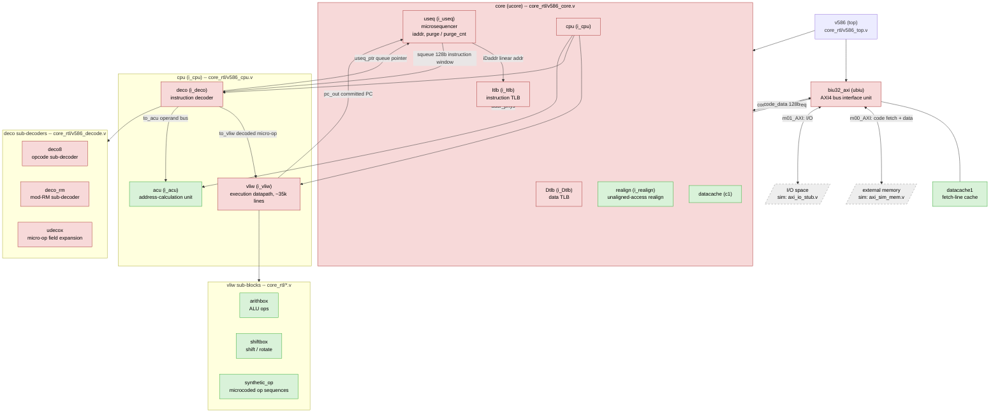

# core_rtl -- module map and open investigation

This document indexes the module hierarchy under `core_rtl/` (see the
top-level [`README`](../README) for how the files here relate to the
original monolithic `v586.v`), and tracks the state of an ongoing
reverse-engineering investigation into the core's reset/boot behavior
(carried out via the Verilator testbench in [`../sim/`](../sim/)).

## Functional block diagram

Red = gate-level netlist (synthesized, no surviving behavioral
structure). Green = readable hand-written behavioral RTL. Grey/dashed =
external to the core (simulation model or real memory/IO).

`dbg_useq_ptr` and `dbg_pc_out` (added to `core`/`v586`'s port lists on
the `reset-vector-0xFFFF0` branch, see `v586_core.v`/`v586_top.v`) expose
`deco`'s `useq_ptr` and `cpu`'s `pc_out` for simulation observability --
see [`../sim/README.md`](../sim/README.md) for why those were added and
what they've shown so far.

## Open investigation: reset vector / boot-time execution pointer

Summary of where this stands (full detail and running log of evidence in
[`../sim/README.md`](../sim/README.md)):

- **Confirmed** (netlist-level, not just simulation): `useq.iaddr`'s
  power-on reset value is `0x000FFC00`, encoded via the async set/clear
  primitive choice on `addr_reg_0`..`addr_reg_31`. This branch edits 6 of
  those registers to change it to `0xFFFF0`.
- **Confirmed** (simulation, `dbg_pc_out`): that `iaddr` edit does NOT
  change where real execution starts. `pc_out` still starts around
  `0xFFC00` regardless, and doesn't behave like simple instruction-by-
  instruction decode during early boot (see below) -- there is a second,
  unidentified mechanism.
- **Found but not fully traced**: `purge`/`purge_cnt` in `useq.v`, a
  boot-time queue/cache-initialization walk (`purge` resets active,
  `purge_cnt` is an 11-bit counter). Its completion path traces through
  `n_36919 = n_61438 | (purge_cnt[10] & purge)`, and `n_61438` is an
  inverter output from `n_61436`, whose driver was not identified.
- **New evidence this may be a red herring for the execution-pointer
  question**: a real, discontinuous jump was observed in `dbg_pc_out` at
  cycle 75 of a fresh-reset run -- far too early for `purge_cnt` to have
  reached its ~1024-count completion threshold. This suggests `purge`
  (useq's internal queue-init walk) and whatever governs `pc_out`'s
  behavior (evidently in `cpu`/`vliw`) may be two separate mechanisms,
  not one gating the other as originally assumed.
- **Trap experiments**: a HLT (`0xF4`) placed at `0xFFC00` did not stop
  execution. A 32-bit near jump (`66 E9 <rel32>`) to `0x00F00000` placed
  at the same address also did not land at its intended target -- instead
  `dbg_pc_out` jumped to `0xA0FB8A`, an address matching neither of the
  bytes' intended semantics. This means either the `0x66` operand-size
  prefix isn't decoded as real x86 would, or something else about the
  encoding assumption is wrong.

### TODO / next steps

1. **Trace `deco`'s `in128` input** (the 128-bit instruction window it
   decodes from, sourced from `useq.squeue`) alongside `dbg_pc_out`, to
   see the actual bytes present at the moment of the `0xA0FB8A` jump --
   ground truth instead of inferring the encoding mismatch from the
   landing address. Requires threading a new debug port through
   `deco` -> `cpu` -> `core` -> `v586` -> `example/v586_example_top.v` ->
   `sim/tb/v586_tb_top.v`, same pattern as `dbg_useq_ptr`/`dbg_pc_out`.
2. **Finish tracing `n_61436`'s driver** in `v586_useq.v`, to fully close
   out when/whether `purge` actually completes. Lower priority now given
   the evidence above that it may not be on the critical path for the
   execution-pointer question, but still an open thread from the
   original reset-vector PR investigation.
3. **Run much longer** (tens/hundreds of thousands of cycles) now that
   `sim/rom/boot.hex` has a boundary guard (`0xFFFFC`: `JMP $-127`)
   keeping the fetch/PC walk from running off the mapped ROM into
   unmapped space -- see `axi_sim_mem.v`'s "no 20-bit wraparound" known
   limitation in `sim/README.md`.
4. Once (1) gives ground truth on the encoding mismatch, retry the
   long-jump trap with a corrected instruction encoding.
