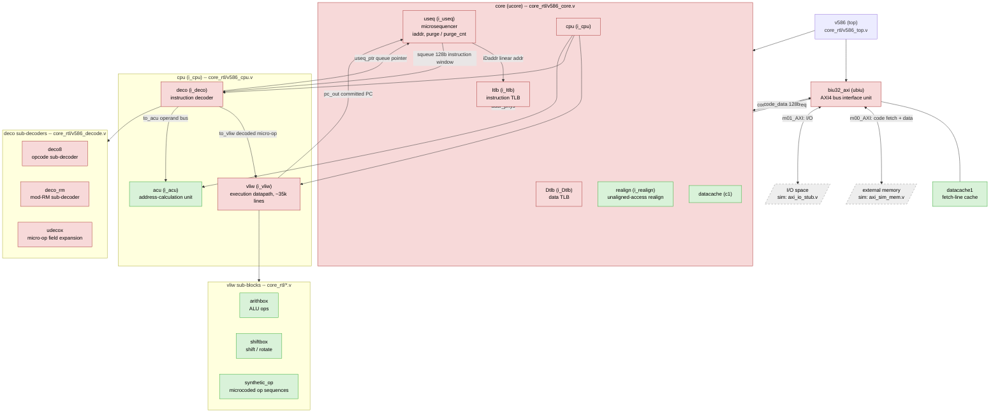

# core_rtl -- module map and open investigation

This document indexes the module hierarchy under `core_rtl/` (see the
top-level [`README`](../README) for how the files here relate to the
original monolithic `v586.v`), and tracks the state of an ongoing
reverse-engineering investigation into the core's reset/boot behavior
(carried out via the Verilator testbench in [`../sim/`](../sim/)).

## Functional block diagram

Red = gate-level netlist (synthesized, no surviving behavioral
structure). Green = readable hand-written behavioral RTL. Grey/dashed =
external to the core (simulation model or real memory/IO).

`dbg_useq_ptr` and `dbg_pc_out` (added to `core`/`v586`'s port lists,
see `v586_core.v`/`v586_top.v`) expose `deco`'s `useq_ptr` and `cpu`'s
`pc_out` for simulation observability -- see
[`../sim/README.md`](../sim/README.md) for why those were added and what
they've shown so far.

## Open investigation: reset vector / boot-time execution pointer

Summary of where this stands (full detail and running log of evidence in
[`../sim/README.md`](../sim/README.md)):

- **Confirmed** (netlist-level, not just simulation): `useq.iaddr`'s
  power-on reset value is `0x000FFC00`, encoded via the async set/clear
  primitive choice on `addr_reg_0`..`addr_reg_31`. This branch briefly
  edited 6 of those registers to change it to `0xFFFF0`, then reverted
  that edit -- `iaddr`'s reset value is back to the confirmed real
  `0xFFC00` in `core_rtl/v586_useq.v`. Reverted because `dbg_pc_out`
  tracing showed the edit didn't change where real execution starts
  anyway (see next point), so it was adding a confound rather than
  answering the actual question.
- **Major finding: `dbg_pc_out` (and the real fetch address) encode
  `{CS, IP}` as a raw 16+16-bit concatenation, not a computed physical
  address.** Discovered via a `boot.asm`-based test (NASM-assembled,
  see `sim/rom/`) containing a far jump (`0xEA`, `JMP ptr16:16`).
  Confirmed three times with three different segment values (`CS=0xF000`,
  `CS=0xFFFF`, `CS=0x000F`) -- in every case the observed fetch address
  and `dbg_pc_out` matched `(CS<<16) | IP` exactly, not real-mode
  `CS*16 + IP`. This retroactively explains earlier confusion: during
  early boot CS happens to be small, so `{CS,IP}` and a real 20-bit
  physical address were numerically indistinguishable, masking this
  until a far jump loaded a large CS value.
- **`sim/rtl/axi_sim_mem.v` now has a shadow ROM mapping** at
  `SHADOW_BASE` (default `0xFFFF_0000`, capped at 64KiB by the 32-bit
  address ceiling -- watch for overflow if you change this parameter,
  see the comment there) mirroring the same ROM content, added
  specifically to observe fetches that land near the top of the address
  space under the `CS<<16|IP` hypothesis instead of just reading
  unmapped zeros.
- **Important correction: instruction-length-aware `pc_out` advancement
  is NOT proof of real execution/retirement.** A `mov ax,0xbeef` /
  `out 0x80,ax` pair was placed at a far-jump target; `dbg_pc_out`
  advanced by exactly 5 (3+2 bytes) in one step, correctly respecting
  both instructions' lengths -- but direct VCD inspection of
  `m01_AXI_AWVALID`/`WVALID` showed the core never actually issued the
  I/O write. So correct length-aware PC advancement is consistent with
  either real execution *or* a prefetch/queue-fill mechanism that parses
  instruction boundaries without retiring them. `sim_main.cpp`'s
  `--io-port` write logging (default port `0x80`) exists specifically to
  get a real, unambiguous "this executed with a side effect" signal
  instead of inferring from PC movement alone -- prefer it over `pc_out`
  position when you can.
- **Found but not fully traced**: `purge`/`purge_cnt` in `useq.v`, a
  boot-time queue/cache-initialization walk (`purge` resets active,
  `purge_cnt` is an 11-bit counter). Its completion path traces through
  `n_36919 = n_61438 | (purge_cnt[10] & purge)`, and `n_61438` is an
  inverter output from `n_61436`, whose driver was not identified. A
  discontinuous `dbg_pc_out` jump was observed as early as cycle 75 of a
  fresh-reset run -- far too early for `purge_cnt` to have reached its
  ~1024-count completion threshold -- suggesting `purge` and whatever
  governs `pc_out` may be separate mechanisms, not one gating the other.
- **Trap experiments, in order tried**: a HLT (`0xF4`) at `0xFFC00` did
  not stop execution. A `0x66`-prefixed 32-bit near jump
  (`66 E9 <rel32>`) to `0x00F00000` did not land at its intended target
  (landed at `0xA0FB8A` instead) -- likely the `0x66` operand-size
  prefix isn't decoded as real x86 would. A plain `0xEA` far jump,
  tried afterward, **worked reliably** (see the major finding above) --
  prefer `0xEA` far jumps over `0x66`-prefixed near jumps for future
  traps/tests.

### TODO / next steps

1. **Get a real "this executed" signal for something other than port
   0x80**, or confirm whether `out 0x80` specifically is unimplemented
   vs. just never-yet-retired -- e.g. run much longer past the point
   where `pc_out` has already scanned through an `out` instruction, to
   see if retirement ever catches up to where prefetch has already
   walked.
2. **Trace `deco`'s `in128` input** (the 128-bit instruction window it
   decodes from, sourced from `useq.squeue`) alongside `dbg_pc_out`, to
   get ground truth on what bytes the decoder actually has at a given
   moment, rather than inferring from PC position or landing addresses.
   Requires threading a new debug port through
   `deco` -> `cpu` -> `core` -> `v586` -> `example/v586_example_top.v` ->
   `sim/tb/v586_tb_top.v`, same pattern as `dbg_useq_ptr`/`dbg_pc_out`.
3. **Finish tracing `n_61436`'s driver** in `v586_useq.v`, to fully close
   out when/whether `purge` actually completes. Lower priority given the
   evidence it may not be on the critical path for the execution-pointer
   question, but still an open thread.
4. **Run much longer** (tens/hundreds of thousands of cycles) now that
   `sim/rom/boot.hex` has a boundary guard (`0xFFFFC`: `JMP $-127`)
   keeping the fetch/PC walk from running off the mapped ROM into
   unmapped space -- see `axi_sim_mem.v`'s "no 20-bit wraparound" known
   limitation in `sim/README.md`.
